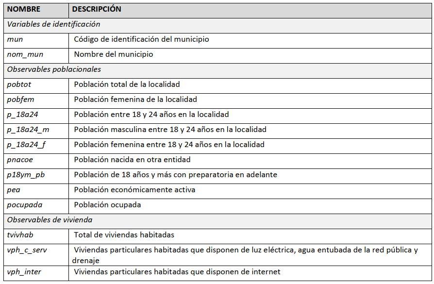
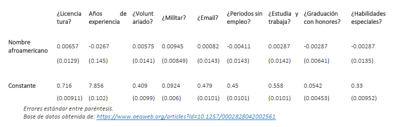
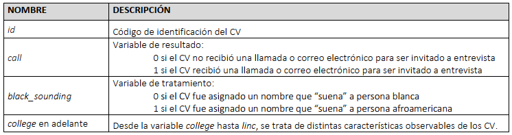
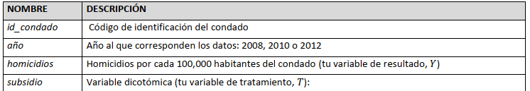
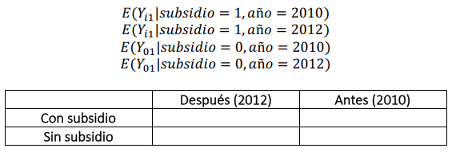

```{=html}
<style>
div.answer {background-color:#f3f0ff; border-radius: 5px; padding: 20px;}
</style>
```
```{r, include=FALSE}
knitr::opts_chunk$set(echo = TRUE,
                      eval = TRUE,
                      error = FALSE,
                      message = FALSE,
                      warning = FALSE,
                      comment = NA)
```

<!-- Do not forget to input your Github username in the YAML configuration up there -->

------------------------------------------------------------------------

```{r eval=FALSE, include=FALSE}

install.packages("lmtest")
install.packages("sandwich")
install.packages("stargazer")
install.packages("patchwork")
install.packages("psych")

```

```{r, include = FALSE}

library(haven)
library(readxl)
library(tidyverse)
library(dplyr)
library(lmtest)
library(sandwich)
library(ggplot2)
library(stargazer)
library(broom)
library(tidyr)
library(kableExtra)
library(patchwork)
library(psych)
```

```{r}

# Datos para ejercicio I. Asignación Aleatoria

base <- read_dta("./Asignación aleatoria.dta")
View(base)

# Datos para ejercicio II. Efecto Promedio del Tratamiento

EPT <- read_dta("./Efecto promedio del tratamiento.dta")
View(EPT)

# Datos para ejecicio III. Diferencia en Diferencias

datos <- read_dta("./Diferencia en diferencias.dta")
View(datos)

```

<br>

------------------------------------------------------------------------

# I. Asignación aleatoria

El Gobierno del Estado de Yucatán está interesado en implementar un nuevo programa en toda la entidad federativa y, tras múltiples reuniones con especialistas, ha decidido otorgarlo de manera aleatoria. El programa consiste en ofrecer capacitaciones sobre diversas habilidades para el empleo a jóvenes que no estudian ni trabajan y que están en búsqueda de empleo.

Los operadores del programa solicitaron apoyo al CIDE para realizar la estrategia de aleatorización. Se determinó que la asignación aleatoria tendría que ser a nivel municipal por cuestiones capacidad operativa. Sólo los jóvenes registrados como habitantes de los municipios de tratamiento serán eegibles para las capacitaciones. Al buscar los datos disponibles en el INEGI sobre el estado, encuentras la base `Asignación aleatoria.dta`, que contiene los resultados principales del estado en el censo a nivel localidad.

En primer lugar, advierte que la base está a nivel localidad, pero tú necesitas tranformarla a nivel municipal. Asegúrate de sumar, para las vaiables que lo necesiten, los datos de cda una de las localidades dentro de cada municiio para obtener los totales municipales corectos. Por ahora, solamente tendrás que agregar y conservar las siguientes variables (puedes descartar las demás):

{width="650"}

------------------------------------------------------------------------

**1.** Colapsa estas variables tomando `mun`como la variable usada para agrupar los municipios. Después, ordena tu base alfabéticamente según los nombres de los municipios resultantes y muestra los primeros cinco y los últimos cinco de la lista. Asegúrate con otras fuentes de tener el número correcto de municipios que existen en Yucatán.

```{r}

# Transformar la base a nivel municipal

datos_mun <- base %>%
  group_by(mun, nom_mun) %>%
  summarise(
    pobtot = sum(pobtot),
    pobfem = sum(pobfem),
    p_18a24 = sum(p_18a24),
    p_18a24_m = sum(p_18a24_m),
    p_18a24_f = sum(p_18a24_f),
    pnacoe = sum(pnacoe),
    p18ym_pb = sum(p18ym_pb),
    pea = sum(pea),
    pocupada = sum(pocupada),
    tvivhab = sum(tvivhab),
    vph_c_serv = sum(vph_c_serv),
    vph_inter = sum(vph_inter)
  )


```

```{r}

# Ordenar alfabéticamente 

datos_mun <- datos_mun %>%
  arrange(nom_mun)

cat("Primeros cinco municipios:")
head(datos_mun, 5)

```

```{r}

cat("Últimos cinco municipios:")
tail(datos_mun, 5)

```

------------------------------------------------------------------------

**2.** Trabajaremos con las observables poblacionales y de vivienda que aparecen arriba para verificar que realmente queden balanceadas. Dado que todas ellas están en valores absolutos (número de personas o de viviendas, respectivamente), nos interesa transformarlas a valores relativos para realmente poder comparar las características observables de los municipios, nuestra unidad de análisis. Convierte todas las observables poblacionales desde `pobfem` hasta `pocupada` a porcentajes de la población total del municipio. Asimismo, convierte `vph_c_serv`y `vph_inter`en porcentajes del total de viviendas habitadas en el municipio. Nombra estas nuevas variables con el prefijo `porc_ (porc_pobfem, porc_p_18a24, etc)`. Después, muestra la estadistica descriptiva de todas las nuevas variables que comienzan con `porc_ (media, desviación estándar, mínimo y máximo son suficientes)`.

```{r}

# Transformar variables a valores relativos

datos_mun <- datos_mun %>%
  mutate(
    porc_pobfem = pobfem / pobtot * 100,
    porc_p_18a24 = p_18a24 / pobtot * 100,
    porc_p_18a24_m = p_18a24_m / pobtot * 100,
    porc_p_18a24_f = p_18a24_f / pobtot * 100,
    porc_pnacoe = pnacoe / pobtot * 100,
    porc_p18ym_pb = p18ym_pb / pobtot * 100,
    porc_pea = pea / pobtot * 100,
    porc_pocupada = pocupada / pobtot * 100,
    porc_vph_c_serv = vph_c_serv / tvivhab * 100,
    porc_vph_inter = vph_inter / tvivhab * 100
  )
```

**Estadísticas descriptivas:**

```{r}

Stats <- datos_mun %>% 
  select(starts_with("porc_")) %>% 
  ungroup() %>% 
  summarise_all(
    list(
      media = mean,
      desviacion_estandar = sd,
      minimo = min,
      maximo = max
    )
  ) %>% 
  select(-contains("mun_")) %>% 
  pivot_longer(cols = 1:40,
               names_to = "Variable",
               values_to = "Valor") 

tabstats <- data.frame(
  Variable = c(str_remove(Stats$Variable[1:10], "_media")),
  Media = c(Stats$Valor[1:10]),
  Desv_Est = c(Stats$Valor[11:20]),
  Mínimo = c(Stats$Valor[21:30]),
  Máximo = c(Stats$Valor[31:40])) %>% 
  mutate(across(where(is.numeric), ~ round(., 2)))

kbl(tabstats, caption = "Estadísticas Descriptivas") %>% 
   kable_styling(bootstrap_options = c("striped", "hover", "condensed"))

```

------------------------------------------------------------------------

**3.** El Gobierno del Estado tiene recursos para implementar el programa en la mitad de los municipios. Asigna de manera aleatoria el programa a la mitad de los municipios, y asigna la otra mitad al grupo de control. Usa `set seed 12345`. Con el comando `tabulate`, muestra que la mitad de tus observaciones han quedado en el grupo de tratamiento y la otra mitad en tu grupo de control.

```{r}

set.seed(12345)

# Crear un vector de asignaciones con 53 tratamientos y 53 controles

asignaciones <- c(rep("tratamiento", 53), rep("control", 53))

# Mezclar aleatoriamente las asignaciones

asignaciones_aleatorias <-  sample(asignaciones, length(asignaciones))

# Unir las asignaciones aleatorias a la base de datos como una columna nueva

datos_mun$asignacion <- asignaciones_aleatorias
```

**Datos de la asignación**

```{r}

table(datos_mun$asignacion)

```

**R** La tabla confirma que, de los 106 municipios del Estado, 53 fueron asignados al grupo de control y 53 al de tratamiento.

------------------------------------------------------------------------

**4.** Verifica que las características observables entre los grupos estén balanceadas. Primero, realiza pruebas *t* para tres de las variables que creaste en la pregunta 2: `porc_pobfem, porc_p_18a24 y porc_vph_inter`. Muestra tus resultados y presenta tus hallazgos en una tabla. ¿Qué concluyes a partir de estas tres pruebas?

```{r}

# Pruebas t para verificar el balance:

ttest_pobfem <- t.test(porc_pobfem ~ asignacion, data = datos_mun)
ttest_p_18a24 <- t.test(porc_p_18a24 ~ asignacion, data = datos_mun)
ttest_vph_inter <- t.test(porc_vph_inter ~ asignacion, data = datos_mun)

```

**Resultados de las pruebas *t***

```{r}

ttest_pobfem
ttest_p_18a24
ttest_vph_inter

```

```{r}

# Creación de la tabla resumen

tabla_ttest <- data.frame(
  variable = c("porc_pobfem", "porc_p_18a24", "porc_vph_inter"),
  media_tratamiento = c(ttest_pobfem$estimate[1], ttest_p_18a24$estimate[1], ttest_vph_inter$estimate[1]),
  media_control = c(ttest_pobfem$estimate[2], ttest_p_18a24$estimate[2], ttest_vph_inter$estimate[2]),
  diff_medias = c(ttest_pobfem$estimate[1] - ttest_pobfem$estimate[2],
                  ttest_p_18a24$estimate[1] - ttest_p_18a24$estimate[2],
                  ttest_vph_inter$estimate[1] - ttest_vph_inter$estimate[2]),
  estadistica_t = c(ttest_pobfem$statistic, ttest_p_18a24$statistic, ttest_vph_inter$statistic),
  p_value = c(ttest_pobfem$p.value, ttest_p_18a24$p.value, ttest_vph_inter$p.value),
  rechazo_hipotesis = c(ttest_pobfem$p.value < 0.05, ttest_p_18a24$p.value < 0.05, ttest_vph_inter$p.value < 0.05)
) %>%  
  mutate(across(where(is.numeric), ~ round(., 3)))

```

```{r}

kbl(tabla_ttest, caption = "Resultados de las pruebas t") %>% 
   kable_styling(bootstrap_options = c("striped", "hover", "condensed"))

```

**R** Los resultados de la prueba arrojan un *p-value* de más de 0.05 para todos los estadísticos *t* analizados, lo que significa que no hay diferencias significativas entre las medias de los grupos. Esto también quiere decir que las diferencias entre ambas medias son iguales a cero, por lo tanto, los grupos son iguales y están balanceados porque no hay evidencia de sesgos de selección entre ellos.

------------------------------------------------------------------------

**5.** Realiza la misma prueba de balance que en la pregunta 4, pero esta vez usando regresiones bivariadas. Señala en tus resultados las diferencias entre las medias, las estadísticas *t* y los *p-values*. ¿Coinciden con los hallazgos encontrados con los de la pregunta 4? ¿Por qué?

```{r}

# Pruebas de balance usando regresiones bivariadas

reg_pobfem <- lm(porc_pobfem ~ asignacion, data = datos_mun)
reg_p_18a24 <- lm(porc_p_18a24 ~ asignacion, data = datos_mun)
reg_vph_inter <- lm(porc_vph_inter ~ asignacion, data = datos_mun)


```

```{r}

stargazer(reg_pobfem, reg_p_18a24, reg_vph_inter, type = "text", title = "Resultados de las regresiones bivariadas", align = TRUE)

```

**R** Se puede apreciar que los resultados de la regresión bivariada son consistentes con los resultados de las pruebas *t*. Los coeficientes de las variables independientes de la regresión son estadísticamente no significativos, lo que significa que son iguales a cero. Por lo tanto, el grupo tratamiento no es estadísticamente distinto del grupo de control, lo cual confirma el balance entre ambos, así como el hecho de que ambos son muestras representativas de la población población total.

------------------------------------------------------------------------

**6.** Ve un paso más allá de lo revisado en clase y compara no sólo las medias, sino las distribuciones (solamente de manera visual). Grafica un diagrama de caja (*boxplot*) que compare las distribuciones para `porc_p_18a24_f`entre tratamiento y control, y otro diagrama de caja para `porc_pnacoe`. ¿Las distribuciones parecen ser balanceadas, por lo menos visualmente?

```{r}

ggplot(datos_mun, aes(x = asignacion, y = porc_p_18a24_f)) +
  geom_boxplot() +
  labs(title = "Distribución de porc_p_18a24_f", x = "Asignación", y = "Porcentaje")

ggplot(datos_mun, aes(x = asignacion, y = porc_pnacoe)) +
  geom_boxplot() +
  labs(title = "Distribución de porc_pnacoe", x = "Asignación", y = "Porcentaje")

```

**R** Visualmente se aprecia que no hay diferencias significativas en las medias de los grupos de control y tratamiento en las dos variables revisadas. Asimismo, sin contar a los *outliers*, se aprecia una distribución muy similar en la variable `porc_pnacoe`, pero en el caso de `porc_p_18a24_f`, pareciera que el grupo de tratamiento es un poco más pequeño que el de control, aunque si se toma en cuenta a los *outliers* la distribución es más parecida. Para el ojo no entrenado, la representación visual de las distribuciones puede ser engañoso, por lo que resulta aun más recomendable recurrir a pruebas formales de balance.

------------------------------------------------------------------------

**7.** Por último, realiza pruebas de balance para las diez observables poblacionales y de vivienda que creaste que comienzan con `porc_`. Usa el paquete `stargazer`. Esto es como la pregunta 5, sólo que con más variables, y todas deben aparecer en una tabla. ¿Qué puedes concluir de los grupos de tratamiento y de control? ¿Qué puedes concluir del proceso de aleatorización?

```{r}

# Pruebas de balance para las poblacionales y de vivienda restantes.

reg_p_18a24_m <- lm(porc_p_18a24_m ~ asignacion, data = datos_mun)
reg_p_18a24_f <- lm(porc_p_18a24_f ~ asignacion, data = datos_mun)
reg_pnacoe <- lm(porc_pnacoe ~ asignacion, data = datos_mun)
reg_p18ym_pb <- lm(porc_p18ym_pb ~ asignacion, data = datos_mun)
reg_pea <- lm(porc_pea ~ asignacion, data = datos_mun)
reg_pocupada <- lm(porc_pocupada ~ asignacion, data = datos_mun)
reg_vph_c_serv <- lm(porc_vph_c_serv ~ asignacion, data = datos_mun)

```

```{r}

stargazer(reg_p_18a24, reg_p_18a24_f, reg_p_18a24_m, reg_p18ym_pb,
          type = "text", 
          title = "Resultados de las regresiones bivariadas. 1a. Parte", 
          align = TRUE)

```

**R** En esta primera parte, los resultados de las regresiones indican que los coeficientes de las variables independientes son estadísticamente no significativos, lo que significa que no hay diferencias significativas entre los grupos de tratamiento y de control. Las pruebas de balance demuestran que ambos grupos son muestras representativas de la población.

```{r}

stargazer(reg_pea,reg_pnacoe, reg_pobfem, reg_pocupada,
          type = "text",
          title = "Resultados de las regresiones bivariadas. 2a. Parte",
          align = TRUE)

```

Los resultados de esta segunda parte son los mismos que los de la primera: los coeficientes de las variables independientes son iguales a cero, por lo que los grupos de control y control y tratamiento no son estadísticamente significativos entre sí, ergo, son muestras representativas de la población.

```{r}

stargazer(reg_vph_c_serv, reg_vph_inter,
          type = "text",
          title = "Resultados de las regresiones bivariadas. 3a. Parte",
          align = TRUE)

```

En esta tercera parte, tampoco hay evidencia de que los coeficientes sean distintos a cero, por lo tanto, tampoco hay diferencias significativas entre los grupos de control y tratamiento, siendo ambos buenas muestras de la población total.

------------------------------------------------------------------------

**8.** El Gobierno del Estado ofreción los recursos humanos y materiales para impartir las capacitaciones a los municipios, pero se encontró con que los ayuntamientos gobernados por el PRI no estaban interesados en recibir este programa del gobernador --quien pertenece al PAN-- y lo rechazaron. De hecho, de los 57 municipios gobernados por el PRI, 29 habían sido originalmente asignados al grupo de tratamiento. Al enterarse de que ya no se usarían estos recursos en esos 29 municipios, algunos alcaldes de partidos con menor presencia en el estado que habían sido originalmente asignados al grupo de control movieron sus influencias con el gobernador para recibir el programa, y finalmente 3 ayuntamientos del PRD, 2 de Movimiento Ciudadano y 2 de Morena lograron recibir el programa a pesar de que su estatus original era de control. Tras dos años de implementación, la tasa de desempleo en jóvenes que no estudian ni trabajan en los municipios originalmente asignados al grupo de tratamiento es de 1.3%, mientras que en los municipios originalmente asignados a contro el de 3.4%. Calcula manualmente los estimadores que podríamos obtener del efecto del programa en este caso y menciona cómo se podrían interpretar.

**R** En la situación planteada por el Gobierno del Estado se observa un cumplimiento imperfecto, esto significa que de los municipios seleccionados no todos recibieron el programa. Lo anterior derivó en desertores y sustituidores. Para calcular el efecto de este fenomeno en la aleatorización, es necesario calcular el estimador de la intención de tratar y el estimado de Wald:

***ITT***: se entiende como el impacto de otorgar el tratamiento

Estimador de Wald: muestra la repercusión de aceptar el tratamiento en aquellos individuos que siguen las indicaciones establecidas.

El ***ITT*** se representaría de la siguiente manera:

Δ ITT= E (Y i dado que A = 1) - E (Yi dado que A = 0) Es decir:

```{r}

ITT <- (1.3 / 100 * 53 / 53) - (3.4 / 100 * 53 / 53)
delta_ITT <- ITT*100
delta_ITT

```

Esto implica que, al proporcionar el programa dirigido a jóvenes que no están empleados ni cursan estudios, es posible que se haya logrado una reducción del 2.1% en la tasa de desocupación.

***Estimador de Wald:***

Δ wald-E (Yi A =1) - E (Yi A = 0) / Pr (T = 1 \| A =1) - Pr(S = 1 \| A = 0)

Δ wald=-2.1 (valor de ITT) / (24/53) - (7/53) = 0.32

Δ wald= -2.1/.32

Δ wald= -6.56

```{r}

delta_wald <- delta_ITT / ((24 / 53) - (7 / 53))
delta_wald

```

De este modo, el impacto de aceptar el tratamiento para aquellos que siguen las indicaciones establecidas conlleva a una disminución del 6.56% en la tasa de desocupación.

------------------------------------------------------------------------

**9.** El gobierno de Yucatán te pide que redactes un breve boletín de prensa (1 cuartilla max) con los resultados obtenidos con este experimento, la explicación de los resultados y posibles acciones a futuro sobre este programa derivados del estudio. Trabaja junto a tu encargado de periodismo para hacer el boletín, de manera concisa y con resultados bien presetados (sin falsos contrafactuales, etcétera)

***Boletín de prensa***

**Nuevas capacitaciones para jóvenes impulsan la empleabilidad en Yucatán**

El Gobierno del Estado de Yucatán, en colaboración con el CIDE, ha llevado a cabo un programa de capacitación dirigido a jóvenes que no estudian ni trabajan y que buscan empleo en toda la entidad federativa. La asignación del programa se realizó de manera aleatoria a nivel municipal, con la mitad de los municipios recibiendo el programa y la otra mitad sirviendo como grupo de control.

El programa ofreció capacitación en diversas habilidades para el empleo a jóvenes de entre 18 y 24 años, con el objetivo de reducir la tasa de desempleo en este grupo de la población. Tras dos años de implementación, los resultados preliminares muestran una disminución en la tasa de desempleo de jóvenes que no estudian ni trabajan en los municipios que recibieron el programa. La tasa de desempleo en este grupo disminuyó a 1.3% en los municipios del grupo de tratamiento, en comparación con el 3.4% en los municipios del grupo de control.

Cabe destacar que la asignación aleatoria permitió un análisis riguroso y balanceado de las características observables de los municipios, lo que garantiza la validez de los resultados obtenidos. Sin embargo, se presentaron algunas complicaciones durante la implementación del programa, ya que 29 municipios gobernados por el PRI rechazaron recibir el programa, mientras que otros 7 municipios de partidos minoritarios fueron incluidos en el programa a pesar de haber sido originalmente asignados al grupo de control.

A pesar de estos cambios en la implementación, los resultados preliminares sugieren que el programa de capacitación ha tenido un impacto positivo en la empleabilidad de los jóvenes yucatecos. El Gobierno del Estado de Yucatán está evaluando la posibilidad de expandir el programa a más municipios y de ajustar su enfoque para abordar las barreras políticas que se presentaron durante la implementación inicial.

El Gobierno del Estado de Yucatán agradece el apoyo del CIDE en la realización de este estudio y espera continuar trabajando juntos para mejorar las condiciones de vida de los jóvenes yucatecos y promover un futuro más próspero para todos.

Con base en estos resultados, se considera que el programa de capacitación ha sido exitoso en términos de mejorar la empleabilidad de los jóvenes en Yucatán y se espera que su expansión a otros municipios permita aumentar el bienestar de la población en toda la entidad. En el futuro, se recomienda una mayor colaboración entre los distintos niveles de gobierno y partidos políticos para asegurar el éxito continuo de este programa y otros similares en beneficio de la población yucateca.

------------------------------------------------------------------------

# II. Efecto promedio del tratamiento

En un experimento (Bertrand y Mullainathan, 2004) sobre discriminación racial en el mercado laboral de Estados Unidos, los investigadores enviaron 5,000 currículum vítae (CV) falsos a ofertas laborales publicadas en los periódicos de Boston y Chicago. Para "manipular" qué raza percibían los empleadores que tenían los candidatos, los investigadores asignaron aleatoriamente nombres típicos de personas blancas (como Emily Walsh o Greg Baker) a la mitad de los CV, y nombres típicos de personas afroamericanas (como Lakisha Washington o Jamal Jones) a la otra mitad. Encontraron que los perfiles con nombres típicos de personas blancas fueron llamados para entrevista 50% más que los perfiles con nombres típicos de personas afroamericanas.

La siguiente tabla incluye algunos de los resultados de regresión de la prueba de balance que realizan los investigadores antes de calcular el efecto del tratamiento. Se trata de regresiones bivariadas en donde la característica observable es la variable dependiente, y la dummy de tratamiento es la independiente. En este ejemplo, "ser asignado un nombre afroamericano" es el tratamiento (*T* = 1) y "ser asignado un nombre blanco" es el control (*T* = 0). Las características observables entre signos de interrogación indican que se trata de variables dummy igual a 1 si el CV cumple con esa característica e igual a 0 si no.

{width="650"}

**1.** Elige tres de las características observables. ¿Existen diferencias significativas entre el grupo de tratamiento y el de control? Demuéstralo con una prueba t para cada variable. ¿Qué puedes concluir a partir de estas tres pruebas?

Los datos de los autores están disponibles en Equipos en el archivo `Efecto promedio del tratamiento.dta`, así como el artículo original, Bertrand y Mullainathan (2004). Las principales variables de la base son:

{width="650"}

```{r}

t.test(EPT$ofjobs ~ EPT$black_sounding, var.equal=TRUE)

t.test(EPT$yearsexp ~ EPT$black_sounding, var.equal=TRUE)

t.test(EPT$fracblack ~ EPT$black_sounding, var.equal=TRUE)

```

**R** Considerando los resultados de las pruebas t que comparan las diferencias en medias en las variables observadas (ofjobs, yearsexp y fracblack) respecto a grupos de control y tratamiento, se encuentra que no existen diferencias estadísticamente significativas entre estos grupos.

------------------------------------------------------------------------

**2.** Replica la prueba de balance, pero esta vez para todas las características observables incluidas en la base (desde college hasta linc). Esta vez, no hagas pruebas t, sino directamente las regresiones bivariadas. Muestra tus resultados en una o dos tablas usando el paquete stargazer en R.

```{r}

PB1 <- lm(college ~ black_sounding, data = EPT)
PB2 <- lm(female ~ black_sounding, data = EPT)
PB3 <- lm(ofjobs ~ black_sounding, data = EPT)
PB4 <- lm(yearsexp ~ black_sounding, data = EPT)
PB5 <- lm(honors ~ black_sounding, data = EPT)
PB6 <- lm(volunteer ~ black_sounding, data = EPT)
PB7 <- lm(military ~ black_sounding, data = EPT)
PB8 <- lm(empholes ~ black_sounding, data = EPT)
PB9 <- lm(workinschool ~ black_sounding, data = EPT)
PB10 <- lm(email ~ black_sounding, data = EPT)
PB11 <- lm(computerskills ~ black_sounding, data = EPT)
PB12 <- lm(specialskills ~ black_sounding, data = EPT)
PB13 <- lm(h ~ black_sounding, data = EPT)
PB14 <- lm(chicago ~ black_sounding, data = EPT)
PB15 <- lm(fracwhite ~ black_sounding, data = EPT)
PB16 <- lm(fracblack ~ black_sounding, data = EPT)
PB17 <- lm(lmedhhinc ~ black_sounding, data = EPT)
PB18 <- lm(fracdropout ~ black_sounding, data = EPT)
PB19 <- lm(fraccolp ~ black_sounding, data = EPT)
PB20 <- lm(linc ~ black_sounding, data = EPT)

```

```{r}

modelos1 <- list(
  PB1 <- lm(college ~ black_sounding, data = EPT),
  PB2 <- lm(female ~ black_sounding, data = EPT),
  PB3 <- lm(ofjobs ~ black_sounding, data = EPT),
  PB4 <- lm(yearsexp ~ black_sounding, data = EPT),
  PB5 <- lm(honors ~ black_sounding, data = EPT)
  
)

stargazer(modelos1, type = "text", title = "Resultados de las regresiones bivariadas",
          model.names = FALSE,
          omit.stat = "f")

```

```{r}

modelos2 <- list(
  PB6 <- lm(volunteer ~ black_sounding, data = EPT),
  PB7 <- lm(military ~ black_sounding, data = EPT),
  PB8 <- lm(empholes ~ black_sounding, data = EPT),
  PB9 <- lm(workinschool ~ black_sounding, data = EPT),
  PB10 <- lm(email ~ black_sounding, data = EPT)
  
)

stargazer(modelos2, type = "text", title = "Resultados de las regresiones bivariadas",
          model.names = FALSE,
          omit.stat = "f")

```

```{r}

modelos3 <- list(
  PB11 <- lm(computerskills ~ black_sounding, data = EPT),
  PB12 <- lm(specialskills ~ black_sounding, data = EPT),
  PB13 <- lm(h ~ black_sounding, data = EPT),
  PB14 <- lm(chicago ~ black_sounding, data = EPT),
  PB15 <- lm(fracwhite ~ black_sounding, data = EPT)
)

stargazer(modelos3, type = "text", title = "Resultados de las regresiones bivariadas",
          model.names = FALSE,
          omit.stat = "f")

```

```{r}

modelos4 <- list(
  PB16 <- lm(fracblack ~ black_sounding, data = EPT),
  PB17 <- lm(lmedhhinc ~ black_sounding, data = EPT),
  PB18 <- lm(fracdropout ~ black_sounding, data = EPT),
  PB19 <- lm(fraccolp ~ black_sounding, data = EPT),
  PB20 <- lm(linc ~ black_sounding, data = EPT)
)

stargazer(modelos4, type = "text", title = "Resultados de las regresiones bivariadas",
          model.names = FALSE,
          omit.stat = "f")

```

------------------------------------------------------------------------

**3.** Del total de regresiones que realizaste, ¿qué porcentaje indica que existe una diferencia estadísticamente significativa entre los grupos?

**R** Solo en 5% de las variables observadas -- computer skills - se evidencian diferencias significativas entre los grupos.

¿Qué podrías concluir de este hallazgo?

**R** Se concluye que en una de las variables observadas se evidencia que los grupos control y tratamiento no se encuentran efectivamente balanceados, lo cual puede introducir sesgos de selección, lo que hará que el cálculo del efecto de tratamiento (ATE) sea sesgado.

¿Qué puedes concluir sobre si la aleatorización se implementó de manera correcta y el balance entre los grupos?

**R** En este caso la aleatorización no se realizó de manera correcta puesto que una de las variables de control se encuentra desbalanceada. En este caso, el incumplimiento del balance puede volver a introducir sesgos de selección entre los grupos. Frente a esto, se puede implementar un estimador que mida la intención de tratar (ITT), que mide el efecto de ofrecer el tratamiento -- más no de recibirlo como tal -, y calcular el estimador de Bloom (ATET), que mide el efecto de realmente recibir el tratamiento, o incluso el estimador de Wald o LATE, que permite medir el efecto promedio local del tratamiento.

### 

**4.** ¿Qué porcentaje de los CV con nombre blanco recibieron una llamada para entrevista? ¿Qué porcentaje de los CV con nombre afroamericano lo hicieron? ¿Cuál es la diferencia en puntos porcentuales?

Recuerda que, cuando la aleatorización se implementa correctamente, todas las características observables y no observables quedan balanceadas entre los grupos, por lo que técnicamente no habría necesidad de incluirlas como variables de control en la regresión (ya han sido controladas ex ante con el diseño aleatorizado). En la práctica, sin embargo, generalmente se incluyen de todas maneras para incrementar la precisión de los estimadores, pero esto no debe alterar demasiado la magnitud del efecto promedio del tratamiento encontrado si la aleatorización se implementó de manera correcta.

Recuerda que por mayor precisión nos referimos a que los errores estándar de los estimadores sean más pequeños, pues esto determina si son significativos o no y qué tan acotado es su intervalo deconfianza. En cambio, por magnitud nos referimos al valor del estimador $(𝛽̂1)$, el cual indica de qué tamaño es el efecto promedio del tratamiento que se está estimando.

```{r}

# porcentaje de los CV con nombre blanco y negro que recibieron una llamada para entrevista

tabla <- table(EPT$black_sounding, EPT$call)
rownames(tabla) <- c("Whitesounding", "Blacksounding")
colnames(tabla) <- c("No recibieron llamada", "Sí recibieron llamada")
addmargins(tabla)


# porcentaje de los CV con nombre blanco que recibieron una llamada para entrevista

percentagewhitesounding_call <- (sum(EPT$black_sounding == 0 & EPT$call == 1) / sum(EPT$black_sounding == 0)) * 100
percentagewhitesounding_call

# porcentaje de los CV con nombre negro recibieron una llamada para entrevista

percentageblacksounding_call <- (sum(EPT$black_sounding == 1 & EPT$call == 1) / sum(EPT$black_sounding == 1)) * 100
percentageblacksounding_call


# Diferencia en puntos porcentuales

diferencia_en_pp <- percentagewhitesounding_call - percentageblacksounding_call

cat("La diferencia en puntos porcentuales es:", diferencia_en_pp, "\n")

```

Porcentaje de CV con nombre blanco que recibieron una llamada para entrevista: 9.65% Porcentaje de CV con nombre afroamericano que recibieron una llamada para entrevista: 6.44% Diferencia en puntos procentuales: 3.20%

### 

**5.** Primero calcula el efecto promedio del tratamiento con una regresión bivariada simple, sin incluir ninguna variable de control.

```{r}

ImpactoSimple <- lm(call ~ black_sounding, data = EPT)
summary(ImpactoSimple)

```

¿Cuál es el efecto promedio del tratamiento?

**R** El resultado promedio es de -0.032.

¿Tu resultado coincide con el de la pregunta 3?

**R** Sí, los resultados coinciden. De acuerdo con la salida de la regresión, sin aplicar el tratamiento, el porcentaje de llamadas es de 0.0965. Una vez aplicado el tratamiento, el coeficiente de la variable (black_sounding) dicotomica es de --0.032, una vez la característica se activa, es decir, cuando black_sounding = 1.

Verifica que tu respuesta coincida con el primer renglón de la Tabla 1 de los autores (p. 997). Interpreta este resultado en un enunciado.

**R** La respuesta coincide con la presentada por los autores. A pesar de que se presenta una ligera diferencia entre el coeficiente resultado de la presente regresión y el presentado por los autores, esta diferencia puede deberse a los algoritmos del software usado. Sin embargo, los coeficientes son muy similares y estadísticamente significativos.

### 

**6.** ¿Cuál es el valor de la constante, 𝛽̂0? ¿Cómo interpretas este valor? ¿Qué es 𝛽̂0 + 𝛽̂1?

El valor de la constante 𝛽̂0 es de 0.0965.

El valor de este coeficiente quiere decir que una vez controladas las variables observables, sin presencia del tratamiento (ya que T = 0), el porcentaje de llamadas a CV con nombre de personas blancas es de 9.65%

El valor de 𝛽̂0 - 𝛽̂1 es equivalente a (0.0965 -- 0.032), es decir 0.0645.

Esto quiere decir que una vez se activa la variable de tratamiento (black_sounding = 1), los CV con nombre afroamericano recibieron un porcentaje de llamadas de 3.2 puntos porcentuales menos que los CV con nombres blancos.

### 

**7.** Ahora, calcula el efecto promedio del tratamiento con una regresión multivariada que incluya todas las variables de control, desde college hasta linc. ¿Incluir estas variables alteró demasiado la magnitud del estimador del ATE? ¿Cómo cambió la precisión del estimador? ¿Qué puedes concluir de incluir o no incluir las variables de control en un experimento cuya aleatorización se implementó de manera correcta?

```{r}

ImpactoMultivariado <- lm(call ~ black_sounding + college + female + ofjobs + yearsexp + honors + volunteer + military + empholes + workinschool+
                        email + computerskills + specialskills + h + chicago + fracwhite + fracblack + lmedhhinc + fracdropout +
                          fraccolp + linc, data = EPT)

summary(ImpactoMultivariado)

```

¿Incluir estas variables alteró demasiado la magnitud del estimador del ATE?

**R** No se vio alterado en mayor magnitud el ATE. A pesar de que el intercepto de la regresión pasó de 0.0965 a -0.151, el valor del ATE, representado por el beta de la variable black_sounding no presento mayores variaciones: pasó de -0.032 a -0.031.

¿Cómo cambió la precisión del estimador?

**R** A pesar de que el estimador no cambió en mayores medidas, la presición del mismo es mucho mejor, en tanto, incluir las variables de control, ayudan a aislar los efectos ajenos al efecto del tratamiento.

¿Qué puedes concluir de incluir o no incluir las variables de control en un experimento cuya aleatorización se implementó de manera correcta?

**R** Si la aleatorización se implementó de manera correcta, el incluir las variables de control en un experimento no ayudaran a obtener un mejor estimador del tratamiento, puesto que, per se, se ha garantizado la inexistencia de sesgos de selección y por tanto se ha garantizado previamente la posibilidad de comparar grupos estadísticamente homogéneos. Sin embargo, ayudan a tener una mejor precisión sobre el impacto del mismo. No obstante, tal como se evidenció en la pregunta anterior, la variación que se tiene sobre el coeficiente no es mayor.

### 

**8.** El editor de una revista de divulgación se ha interesado en este experimento y a sabiendas de la reputación de los estudiantes de posgrado del CIDE en evaluación, contacta a tu grupo para que escriba una breve reseña del estudio que pueda captar el interés del público en general. Esta reseña no debe exceder de 1 de cuartilla.

**Los efectos del sesgo inconsciente en la contratación: La brecha laboral entre blancos y negros.**

Una prestigiosa universidad de Estados Unidos realizó un estudio para determinar si hay discriminación racial en los procesos de selección de personal entre personas blancas y negras. Los datos fueron analizados por los alumnos del CIDE, algunos de los resultados encontrados por los alumnos son alarmantes: la probabilidad de ser llamado para una entrevista es menor para los candidatos con nombres afroamericanos que para los candidatos con nombres blancos. En concreto, se observó una diferencia de 3.1 puntos porcentuales en la tasa de llamadas entre ambos grupos. Este resultado sugiere que todavía existe discriminación racial en el mercado laboral de Estados Unidos y que los empleadores tienen más probabilidades de invitar a los solicitantes de empleo con nombres típicos de personas blancas para entrevistas en comparación con los solicitantes de empleo con nombres típicos de personas afroamericanas. Los estudios estadísticos realizados en la Universidad Estadounidence indicaron que una de las variables, a la que nombraron "black_sounding" , haciendo alusión a los CV que contenían nombres típicos de la comunidad afroamericana, tienen un efecto negativo significativo en la tasa de llamadas de los empleadores. Es decir, los CV con nombres afroamericanos recibieron un porcentaje de llamadas 3.1 puntos porcentuales menos que los CV con nombres blancos. El estudio también incluyó otras variables como el grado de escolaridad, el sexo y los años de experiencias, entre otras, que fungieron como variables de control en el proceso con el objetivo de aislar los efectos específicos de la racialidad.

La diferencia en las tasas de llamadas entre comunidad negra y blanca puede tener implicaciones éticas y legales, ya que podría indicar discriminación racial en el proceso de selección de empleo. Es importante destacar que el estudio no sugiere que todos los empleadores estén discriminando activamente, sino que hay una disparidad en las tasas de llamadas que puede estar influenciada por prejuicios inconscientes.

Aunque solo una de las variables analizadas, las habilidades informáticas, mostró diferencias significativas entre los grupos, es decir, evidenció la existencia de un desbalanceo entre los grupos de comparación, la presencia de una brecha en las tasas de llamadas para entrevistas entre los solicitantes de empleo con nombres afroamericanos y blancos sugiere que aún hay trabajo por hacer para lograr una mayor igualdad de oportunidades en el mercado laboral.

Los resultados del estudio destacan la necesidad de seguir trabajando en la lucha contra la discriminación racial en el mercado laboral. El hecho de que los candidatos con nombres afroamericanos sean menos propensos a ser llamados para una entrevista sugiere que el proceso de selección de empleo es desigual y discriminatorio. Es importante que los empleadores tomen medidas para garantizar que todos los candidatos sean considerados de manera justa y equitativa, independientemente de su raza o etnia. Además, este estudio es un llamado a la sociedad para reflexionar sobre la importancia de la igualdad de oportunidades en el mercado laboral y trabajar juntos para lograr un mundo más justo e inclusivo.

------------------------------------------------------------------------

# III. Diferencia en diferencias

El gobierno central de un país lejano inició un programa nacional de subsidios para construcción de áreas verdes en zonas urbanas de los condados, la unidad más pequeña de su división política. Este país lleva algunos años en los que la violencia ha aumentado en diferentes regiones luego de cambios importantes en la política de seguridad. El programa tiene la (debatible) teoría de cambio de que las áreas verdes, como los parques y espacios de recreación, favorecen la convivencia y el espíritu comunitario, lo cual ayuda a que se recupere el tejido social y se reduzca la violencia.

En 2010 se lanzó una convocatoria abierta, a la cual podían postular todos aquellos condados que fueran urbanos o semiurbanos. Los condados que desearan ser candidatos debían preparar una propuesta de desarrollo urbano en la cual especificaran las distintas características de su proyecto (dónde se construiría el área verde, cuáles eran sus objetivos, qué efectos positivos se esperaba que pudieran tener en la zona y por qué, presupuesto y plan de trabajo, etcétera). Posteriormente, un comité técnico de empleados del programa evaluó las propuestas y decidió otorgar los subsidios a los mejores proyectos.

Como puedes ver, la asignación del programa no es aleatoria. En este ejercicio realizarás un diseño dediferencia en diferencias para evaluar el impacto del programa de áreas verdes.

La base `Diferencia en diferencias.dta` contiene datos longitudinales para 10,000 condados urbanos y semiurbanos de este país en tres años diferentes: 2008, 2010 y 2012. Las variables incluidas en la base son:

{width="650"} {width="650"}

Entre 2010 y 2012, la mitad de los condados recibieron el subsidio.

**1.** Dado que el programa otorgó los subsidios después de que se obtuvieron los datos de 2010 que tienes en tu base, por ahora considera 2010 como el "antes" y 2012 como el "después". Calcula las siguientes medias condicionales de los homicidios y acomódalas en la siguiente tabla:

{width="650"}

**R** Se tiene una media condicional de homicidios del grupo con subsidio para 2010 de 90.45 y para 2012 de 89.47 mientras que para el grupo sin subsidio se tiene una media condicional en 2010 de 84.48 y para 2012 de 85.48

```{r}

# Filtrar los datos para los años 2010 y 2012 y los subsidios otorgados
datos_2010 <- subset(datos, año == 2010 & subsidio == 1)
datos_2012 <- subset(datos, año == 2012 & subsidio == 1)
datos_2010_sin <- subset(datos, año == 2010 & subsidio == 0)
datos_2012_sin <- subset(datos, año == 2012 & subsidio == 0)

# Calcular las medias condicionales
media_condicional_2010 <- mean(datos_2010$homicidios)
media_condicional_2012 <- mean(datos_2012$homicidios)
media_condicional_2010_sin <- mean(datos_2010_sin$homicidios)
media_condicional_2012_sin <- mean(datos_2012_sin$homicidios)

# Crear la tabla
tabla_esperanza <- matrix(c(media_condicional_2010, media_condicional_2012, media_condicional_2010_sin, media_condicional_2012_sin), nrow = 2, byrow = TRUE)
colnames(tabla_esperanza) <- c("2010", "2012")
rownames(tabla_esperanza) <- c("Subsidio otorgado", "Subsidio no otorgado")

# Imprimir la tabla
print(tabla_esperanza)
```

------------------------------------------------------------------------

**2.** Con base en tu tabla de la pregunta 1, calcula el estimador de diferencia en diferencias de manera manual.

**R** El estimador de diferencia en diferencias es de -1.98

```{r}

# Calcular el estimador de diferencia en diferencias
estimadorDiD <- ((media_condicional_2012 - media_condicional_2010)-(media_condicional_2012_sin - media_condicional_2010_sin))

# Imprimir el estimador de diferencia en diferencias
print(estimadorDiD)

```

------------------------------------------------------------------------

**3.** Ahora, obtén el estimador de diferencia en diferencias mediante una regresión. ¿Cuál es el modelo de regresión con el que lo obtendrás? ¿Cuál de tus parámetros es el que captura el estimador de diferencia en diferencias? Utiliza notación para responder estas preguntas. Luego, muestra tus resultados de regresión. ¿Obtienes el mismo valor que en la pregunta 2? ¿Qué valor agrega obtenerlo con una regresión en comparación con la manera manual?

**R** Se propone un modelo de regresión lineal con la forma Y_it=𝛽_0 +𝛽_1(después_t) + 𝛽_2(T_i) + 𝛽_3(después_t\*T_i) + e_it en donde 𝛽_3 es el estimador de la diferencia en diferencias obteniendo el mismo estimador de -1.98 que en el cálculo anterior.

```{r}
did2 <- rbind(datos[datos$año==2010, ], datos[datos$año==2012, ])

#Las dumificamos
did2$después <- ifelse(did2$año==2012, 1, 0)

#Creamos la interacción
did2$después.sub <- did2$después * did2$subsidio

#Sacamos la regresión
summary(lm(homicidios ~ después + subsidio + después.sub, data = did2))
```

------------------------------------------------------------------------

**4.** Para verificar la plausibilidad del supuesto de tendencias paralelas, utiliza los datos que tienes en tu base anteriores a la asignación del programa (2008). Muestra las tendencias de la variable de resultado para el grupo con subsidio y el grupo sin subsidio en una misma gráfica. Por lo menos visualmente, ¿las tendencias entre los grupos eran paralelas antes de la asignación del programa en 2010? ¿Qué implica esto para la comparabilidad entre los grupos y tu estimador de diferencia en diferencias?

**R** Gráficamente se observa que las tendencias iniciales no son paralelas lo que rompe el supuesto principal de la metodología de Diferencia en Diferencias de tendencias iniciales paralelas. Esto implica que no se tiene evidencia suficiente para afirmar que el cambio en la tendencia de homicidios es consecuencia de la intervención.

```{r}

# Agregar la variable después a la base de datos
datos$después <- ifelse(datos$año >= 2012, 1, 0)

# Filtrar los datos para los dos períodos de interés
datos_tendencias1 <- subset(datos, año %in% c(2008:2010))
datos_tendencias2 <- subset(datos, año %in% c(2010:2012))

# Crear la primera gráfica para el período de 2008 a 2010
grafica1 <- ggplot(datos_tendencias1, aes(x = año, y = homicidios, color = factor(subsidio), shape = factor(subsidio))) +
  geom_point(size = 3) +
  geom_smooth(method = "lm", se = FALSE, fullrange = TRUE) +
  scale_color_manual(name = "Subsidio", values = c("blue", "red")) +
  scale_shape_manual(name = "Subsidio", values = c(19, 3)) +
  labs(title = "Tendencias de la variable de resultado antes de la asignación del programa",
       x = "Año",
       y = "Número de homicidios") +
  facet_wrap(~ factor(subsidio))

# Crear la segunda gráfica para el período de 2010 a 2012
grafica2 <- ggplot(datos_tendencias2, aes(x = año, y = homicidios, color = factor(subsidio), shape = factor(subsidio))) +
  geom_point(size = 3) +
  geom_smooth(method = "lm", se = FALSE, fullrange = TRUE) +
  scale_color_manual(name = "Subsidio", values = c("blue", "red")) +
  scale_shape_manual(name = "Subsidio", values = c(19, 3)) +
  labs(title = "Tendencias de la variable de resultado después de la asignación del programa",
       x = "Año",
       y = "Número de homicidios") +
  facet_wrap(~ factor(subsidio))

# Combinar las dos gráficas en una sola
#install.packages("patchwork")
library(patchwork)
grafica1 + grafica2 + plot_layout(ncol = 2)
```

**5.** Con los resultados obtenidos en este estudio, escribe una nota que será publicada en uno de los más influyentes diarios de este país lejano.

**R** La validez del método de Diferencia en Diferencias (DiD) se basa en el supuesto de que las tendencias de ambas poblaciones (tratamiento y control) se habrían mantenido constantes si no hubiera ocurrido el tratamiento. En otras palabras, las poblaciones habrían evolucionado de manera similar en ausencia del tratamiento. En el análisis que realizamos, la diferencia en diferencias estimada sugiere que la asignación del subsidio tuvo un efecto negativo en la tasa de homicidios en el grupo de tratamiento de 1.98. Sin embargo, para la validez de este análisis, es necesario que las tendencias de ambas poblaciones sean paralelas antes de la asignación del tratamiento. En nuestro análisis, graficamos las tendencias de la variable de resultado para ambos grupos antes de la asignación del tratamiento, para verificar la plausibilidad del supuesto de tendencias paralelas y las tendencias no parecen ser paralelas. Esto puede poner en duda la validez de los resultados obtenidos mediante el método DiD.

En conclusión, si bien posterior al tratamiento en el grupo tratado se produjo una disminución de homicidios, no hay evidencia suficiente para asegurar que el tratamiento es la causa de dicha disminución.

------------------------------------------------------------------------

# Refencias

Marianne Bertrand y Sendhil Mullainathan, "Are Emily and Greg More Employable than Lakisha and Jamal? A Field Experiment on Labor Market Discrimination", *The American Economic Review*, 2004, 94 (4), p. 1000.
